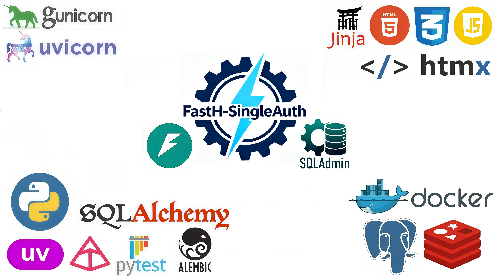

<p align="center">
  <b>English</b> | <a href="..">Русский</a>
</p>

---

#  FastH-SingleAuth

**FastH-SingleAuth** — A lightweight and modern template for building personal websites and landing pages with **FastAPI**, 
featuring a preconfigured admin panel and secure authentication.



## 📚 Table of Contents
- [🛠️ Tech Stack](#-tech-stack)
- [✅ Features](#-features)
- [📂 Project Structure](#-project-structure)
- [⚙️ Installation and Setup](#-installation-and-setup)
- [📬 Contacts](#-contacts)

## 🛠️ Tech Stack

| Components | |
|----------|---:|
| **🐍 Language:** Python 3.14+ | [](https://www.python.org/) |
| **⚡ Framework:** FastAPI | [](https://fastapi.tiangolo.com/) |
| **🪄 Frontend:** HTMX | [](https://htmx.org) |
| **🚀 ASGI Server:** Uvicorn + Gunicorn | [](https://www.uvicorn.org/) [](https://gunicorn.org/) |
| **🗄️ Database:** PostgreSQL (asyncpg) | [](https://www.postgresql.org/) |
| **🔁 ORM:** SQLAlchemy (async) | [](https://www.sqlalchemy.org/) |
| **🔄 DB Migrations:** Alembic | [](https://alembic.sqlalchemy.org/) |
| **🔧 Admin Panel:** SQLAdmin | [](https://aminalaee.dev/sqladmin/) |
| **✅ Validation:** Pydantic v2 + pydantic-settings | [](https://docs.pydantic.dev/) [](https://docs.pydantic.dev/latest/concepts/pydantic_settings/) |
| **🧩 Caching:** Redis + fastapi-cache2 | [](https://redis.io/) |
| **📄 Templating:** Jinja2 | [](https://jinja.palletsprojects.com/) |
| **🛡️ Security:** CORS + Nginx Rate Limiting | [](https://fastapi.tiangolo.com/tutorial/cors/) [](https://nginx.org/en/docs/http/ngx_http_limit_req_module.html) |
| **📦 Package Manager:** uv | [](https://docs.astral.sh/uv/) |
| **🐳 Containerization:** Docker + Docker Compose | [](https://www.docker.com/) [](https://docs.docker.com/compose/) |
| **🧪 Testing:** Pytest + httpx + faker | [](https://docs.pytest.org/) [](https://www.python-httpx.org/) [](https://faker.readthedocs.io/) |
| **📘 Documentation:** OpenAPI (Swagger UI) | [](https://swagger.io/specification/) |
| **🧹 Code Formatting:** Black | [](https://black.readthedocs.io/) |
| **📊 Test Coverage:** pytest-cov | [](https://pytest-cov.readthedocs.io/) |

## ✅ Features

- **🔐 Lightweight Authentication (SingleAuth System)**  
  > Secure login for a single administrator via session cookies.  
  > No extra user registrations — just you and your content.  
  > Protection against `XSS` and `CSRF` at the middleware level.

- **🛡️ Infrastructure Security (Nginx Rate Limiting & Security Headers)**  
  > Automatic setup of security HTTP headers (HSTS, Content-Security-Policy, X-Frame-Options) for production protection.  
  > CORS configuration for safe communication with frontend applications.  
  > Project architecture is ready for deployment with Nginx as a reverse proxy.  
  > Built-in network-level rate limiting to protect admin panel and search endpoints from bots.

- **🛠️ Professional Admin Panel (SQLAdmin)**  
  > Full-featured interface for data management: CRUD operations, filtering, and search across all database models directly in the browser.

- **🏗️ Modern Architecture (Clean Architecture)**  
  > Clear separation into independent layers: Views, Services, Repositories, and Models.

- **💎 Modern Frontend (HTMX + Glassmorphism)**  
  > Dynamic user interface without heavy JavaScript frameworks.  
  > Interactive search, live forms, and stylish glassmorphism design.

- **🚀 Reactive Dependency Management (uv)**  
  > Instant dependency resolution and virtual environment setup using the ultra-fast `uv` package manager.

- **🗄️ Data Handling (SQLAlchemy 2.0)**  
  > Fully asynchronous interaction with `PostgreSQL (asyncpg)`.  
  > Universal base repository to minimize boilerplate code when working with the database.

- **🔄 Automated Migrations (Alembic)**  
  > Database schema management with async support.  
  > Migrations are automatically applied on container startup.

- **📧 Asynchronous Notifications (aiosmtplib)**  
  > Send system and transactional emails (registration confirmation, password reset) without blocking the main application thread.

- **🧩 Caching (Redis + fastapi-cache2)**  
  > Integration with `Redis` to cache heavy queries, significantly reducing database load and improving API response speed.

- **📦 Containerization (Docker & Docker Compose)**  
  > Ready-to-use infrastructure with `Docker Compose`: app, database, Redis, and PGAdmin run with a single command.

- **🧪 Reliable Testing (Pytest)**  
  > Preconfigured environment for testing asynchronous APIs using `HTTPX`.  
  > Fake data generation via `Faker` and coverage reports using `pytest-cov`.

- **📘 Clean Documentation (Swagger/OpenAPI)**  
  > Interactive API documentation, automatically disabled in production mode for enhanced security.

## 📂 Project Structure

```bash
FastH-SingleAuth/
├── app/                         # Main application package
│   ├── admin/                   # SQLAdmin configuration
│   ├── alembic/                 # Database migration history
│   ├── core/                    # Core components
│   │   ├── cache/               # Redis caching setup
│   │   ├── gunicorn/            # Production WSGI config
│   │   ├── config/              # Settings validation (pydantic-settings)
│   │   ├── db_helper.py         # SQLAlchemy engine/session setup
│   │   └── templates.py         # Jinja2Templates integration
│   ├── exceptions/              # Exception handling
│   │   ├── custom.py            # Custom error classes
│   │   └── handlers.py          # Global exception handlers
│   ├── middleware/              # Custom middleware
│   ├── models/                  # ORM models (SQLAlchemy)
│   ├── repositories/            # Data Access Layer
│   │   └── crud_manager.py      # Universal CRUD manager
│   ├── schemas/                 # Pydantic DTOs for validation
│   ├── services/                # Business logic layer
│   ├── static/                  # Static files (CSS, JS, images)
│   ├── templates/               # HTML templates (Jinja2)
│   ├── utils/                   # Utility functions
│   │   └── case_converter.py    # Table name converter
│   ├── views/                   # HTML rendering routers
│   ├── .env                     # Environment variables (not in git)
│   ├── .env.template            # Template for .env
│   ├── alembic.ini              # Alembic config
│   ├── create_fastapi_app.py    # FastAPI app factory
│   ├── main.py                  # Dev mode entry point
│   ├── run.py                   # Gunicorn runner (for Docker)
│   └── run_main.py              # Gunicorn app launcher
├── docker-build/                # Build infrastructure
│   └── app/
│       ├── Dockerfile           # Docker build instructions
│       └── prestart.sh          # DB prep script (migrations + admin creation)
├── tests/                       # Automated tests (Pytest)
├── docker-compose.yml           # Container orchestration
├── pyproject.toml               # Project config and dependencies
└── uv.lock                      # Fixed dependency versions
```

## ⚙️ Installation and Setup

1. **Clone the repository**
> In terminal:
> ```bash
> git clone https://github.com/Mishchenko-Vladimir/FastH-SingleAuth.git
> ```
> Navigate to project directory:
> ```bash
> cd FastH-SingleAuth
> ```
 
2. **Configure environment variables**
> Fill in `.env.template` and `docker-compose.yml` with your values.

3. **Development and customization**
> Sync virtual environment:
> ```bash
> uv sync
> ```
> Apply migrations:
> ```bash
> cd app
> alembic upgrade head
> cd ..
> ```
>  Edit or add new files in `app/` — changes will be reflected automatically in the running container.
>
> Local launch (without Docker):
> ```bash
> uv run python app/main.py
> ```

4. **Run via Docker**
> If you are running the image on Windows, make sure that the files `docker-build/app/prestart.sh` and `app/run.py` use LF line endings, not CRLF.
> 
> Build image named `app`:
> ```bash
> docker compose build app
> ```
> Start containers:
> ```bash
> docker compose up -d
> ```
> Other Docker commands:
> - `docker compose ps` — view running containers
> - `docker compose logs -f app` — view app logs
> - `docker compose stop` — stop app
> - `docker compose down` — remove containers

> The app will be available at http://localhost:8000, documentation at http://localhost:8000/docs

## 📬 Contacts

### 💻 Author: Vladimir Mishchenko
- **GitHub:** [Mishchenko-Vladimir](https://github.com/Mishchenko-Vladimir)
- **Mail.ru:** [mishchienko.2001@mail.ru](mailto:mishchienko.2001@mail.ru)
- **Gmail:** [mishchieko.2001@gmail.com](mailto:mishchieko.2001@gmail.com)
- **Telegram:** [@VM_Dev](https://t.me/VM_Dev)

💌 Don’t forget to leave a ⭐ star on GitHub if you like the project! 😉

---

> *💡 **Looking for more?***
>
> *If you need an extended version with full **Auth & Security** (`FastAPI-Users`), ready-to-use **Interactive UI** (`HTMX` + `Jinja2`),  
> built-in **CSRF protection**, and a modern **Glassmorphism-style** interface, check out this project:*  
> 
> *[🚀 **FastH-Core-Stack**](https://github.com/Mishchenko-Vladimir/FastH-Core-Stack)*

---
[↑ Back to top](#-fastapi-boilerplate)
